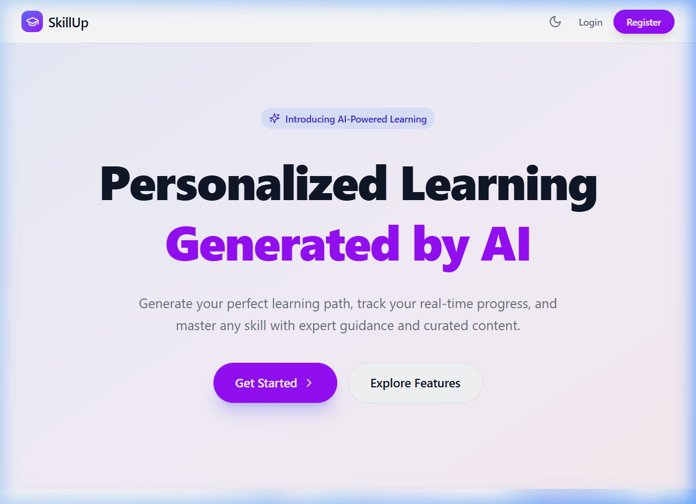
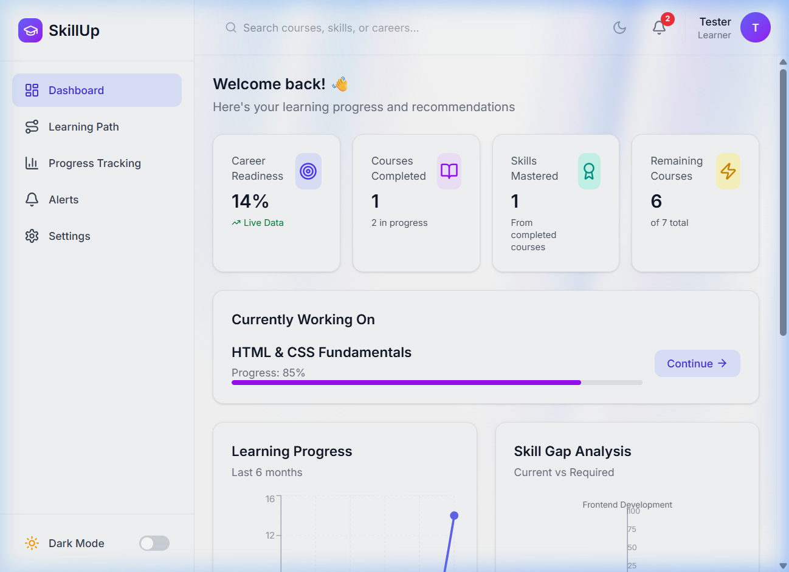
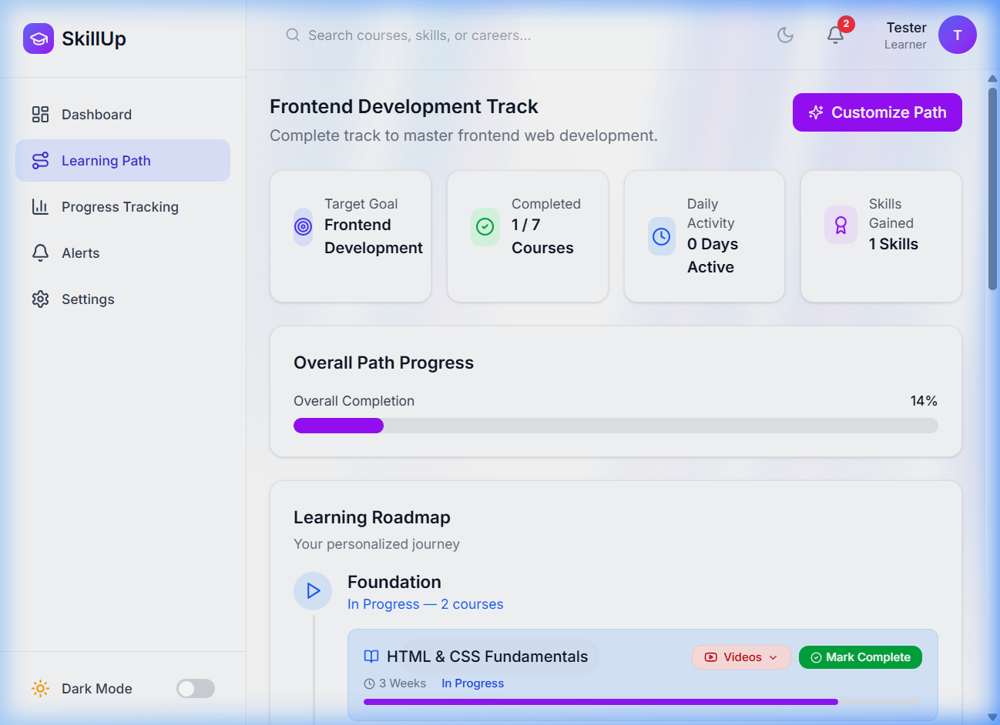
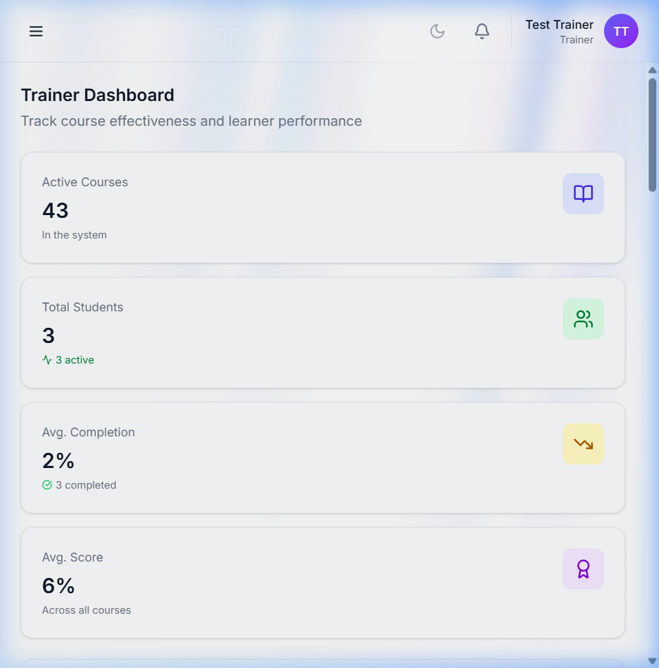
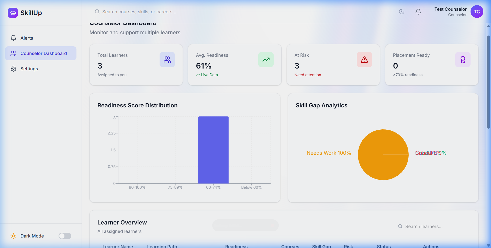

# SkillUp - AI-Powered Learning Path & Course Tracker

SkillUp is a modern, comprehensive, role-based educational tracking platform. It empowers **Learners** with personalized, AI-driven learning paths, helps **Trainers** monitor student engagement and identify struggling learners, and provides **Counselors** with a high-level analytics dashboard to track student readiness and close skill gaps.

---

## 🚀 Key Features

### 👤 Learner Features
- **Personalized Learning Paths:** Enter your career goal, and the platform generates a structured path consisting of three stages: **Foundation**, **Core Skills**, and **Advanced Topics**.
- **Course Enrollment & Progress Tracking:** Track your progress across enrolled courses, view upcoming milestones, and celebrate achievements with animated visual rewards.
- **YouTube Resource Search:** Automatically fetch curated study videos matching the course modules using search tools directly integrated with the application.
- **Activity Log & Alerts:** Keep track of recent dashboard actions and notifications sent by trainers and counselors.

### 🏫 Trainer Features
- **Engagement Analytics:** View overall stats, enrollment counts, average course scores, and course completion rates.
- **Struggling Learners Identification:** Automatically flag students with low engagement (<40% progress) or overdue tasks, with quick tools to send reminders or encouragement.
- **Trainer Allocation:** Easily allocate trainers or update course ownership.

### 👔 Counselor Features
- **Readiness & Risk Classification:** Monitor student readiness scores and track students flagged as **High Risk** (<40%), **Medium Risk** (40-70%), or **Low Risk** (>70%).
- **Skill Gap Analysis:** Visualize students' acquired versus required skills with structured graphs. Detailed profiles allow counselors to inspect specific missing skills and assign custom learning tracks.

---

## ✨ Visual Preview

### 🏠 Landing Page


### 👤 Learner Dashboard


### 🗺️ Learning Path Track


### 🏫 Trainer Dashboard


### 👔 Counselor Dashboard


---

## 🛠️ Technology Stack

### Frontend
- **Framework:** Vite + React
- **Styling:** Tailwind CSS (v4) & Material-UI (MUI) Icons
- **Animation:** Framer Motion (`motion`), Canvas Confetti
- **State & Routing:** React Router v7, React Hook Form
- **Analytics Charts:** Recharts

### Backend
- **Server:** Node.js + Express.js
- **Database:** MongoDB (via Mongoose ODM)
- **Authentication:** JWT (JSON Web Tokens), bcryptjs, Google OAuth
- **APIs & Utilities:** `yt-search` (YouTube API Integration)

---

## ⚙️ Project Setup & Installation

Follow these steps to set up the project locally:

### 1. Prerequisites
Ensure you have the following installed on your machine:
- [Node.js](https://nodejs.org/) (v16.x or higher recommended)
- [MongoDB](https://www.mongodb.com/) (running locally or a MongoDB Atlas URI)

### 2. Install Dependencies
Run the following command in the root folder of the project to install all required frontend and backend dependencies:
```bash
npm install
```

### 3. Configure Environment Variables
Create a file named `.env` in the root directory and add the following configuration:
```env
PORT=5000
MONGO_URI=mongodb://localhost:27017/skillup
JWT_SECRET=super_secret_skillup_token_key_123_abc
VITE_GOOGLE_CLIENT_ID=your_google_client_id_here
```
> 💡 *Note: Adjust the `MONGO_URI` and `VITE_GOOGLE_CLIENT_ID` values according to your MongoDB database configuration and Google API credentials.*

### 4. Seed the Database
To populate the database with default courses, default users, learning paths, and sample enrollments, execute the seeding script:
```bash
node server/seed.js
```
> ⚠️ *Important: Ensure your MongoDB server is running before running this command.*

---

## 🏃 Running the Application

You can run both the frontend development server and backend Express server concurrently with a single command:

```bash
npm run dev:full
```

This script will start:
- **Express Backend Server:** running on [http://localhost:5000](http://localhost:5000)
- **Vite React Frontend:** running on [http://localhost:5173](http://localhost:5173/SkillUp/)

### Individual Commands
If you wish to run the frontend or backend servers independently:
- **Start Backend server only (with Nodemon):**
  ```bash
  npm run server
  ```
- **Start Frontend dev server only:**
  ```bash
  npm run dev
  ```
- **Build Frontend for Production:**
  ```bash
  npm run build
  ```

---

## 📁 Folder Structure

```text
SkillUp/
├── .github/              # CI/CD Workflows
├── server/               # Express.js Backend
│   ├── config/           # Database configurations
│   ├── middleware/       # Auth and role security guards
│   ├── models/           # Mongoose schemas (User, Course, LearningPath, etc.)
│   ├── routes/           # REST API routes (Auth, Learner, Videos, Roles, etc.)
│   └── seed.js           # Database seeding script
├── src/                  # React Frontend (Vite)
│   ├── app/              # Router, contexts, pages, custom hooks
│   │   ├── components/   # Application page components
│   │   ├── pages/        # Dashboard panels (Learner, Trainer, Counselor, LandingPage)
│   │   └── routes.jsx    # React Router setup
│   ├── components/       # Reusable layout UI components
│   └── main.jsx          # App entry point
├── package.json          # Node dependencies and scripts
└── vite.config.ts        # Vite configuration
```

---

## 🔌 API Endpoints Reference

| Route | Method | Description | Role Required |
| :--- | :---: | :--- | :--- |
| `/api/auth/register` | `POST` | User registration | Guest |
| `/api/auth/login` | `POST` | Local login (returns JWT) | Guest |
| `/api/auth/google` | `POST` | Google OAuth login | Guest |
| `/api/learner/profile` | `GET` | Retrieve logged-in learner profile | Learner |
| `/api/learner/path-generator` | `POST` | Generate path from goals / interests | Learner |
| `/api/learner/videos` | `GET` | Get YouTube video study resources | Learner |
| `/api/notifications` | `GET` | List notifications for the user | Any Authenticated |
| `/api/trainer/dashboard` | `GET` | Metrics and student list for trainers | Trainer |
| `/api/counselor/dashboard`| `GET` | Global engagement metrics & risk analysis | Counselor |
| `/api/counselor/learner/:id`| `GET`| Detailed profile & skill gap analysis | Counselor |
